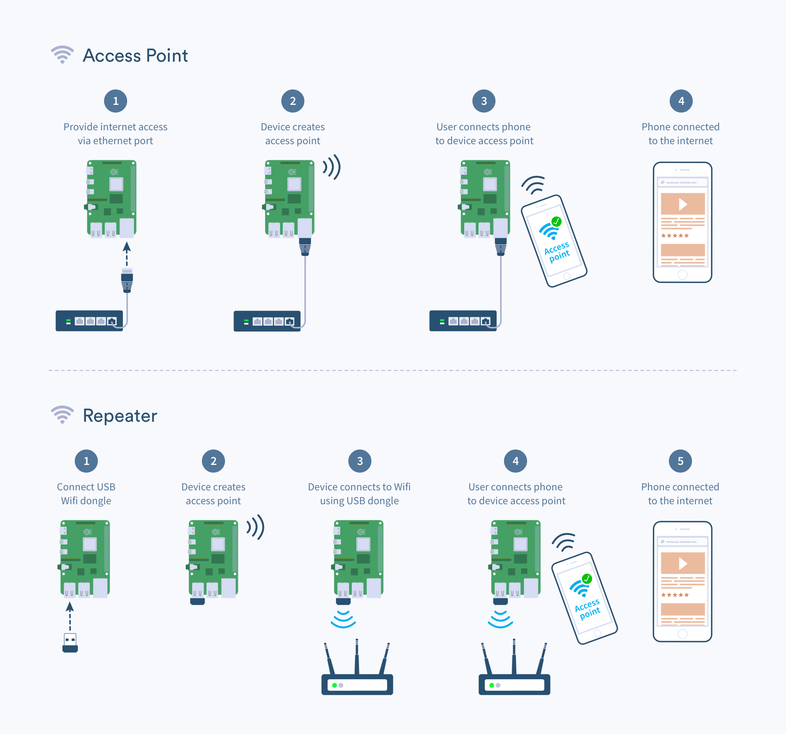

# WiFi Repeater

WiFi Repeater project is a utility to dynamically extend an existing wired or wireless network. To achieve this the utility uses the onboard WiFi chip to create an access point you can connect your devices to.
To enable internet access you can either plug an ethernet cable (AP mode) or use a secondary WiFi interface (by using a USB WiFi dongle) to connect to an internet enabled network.

WiFi Repeater can work in the following modes:
- Access Point: extend an existing ethernet connection with an access point network
- Repeater: extend an existing wireless connection with an access point network. Requires the use of a USB Wifi dongle (see [this](https://www.balena.io/docs/reference/hardware/wifi-dongles/) list for recommended dongles)

## How it works

WiFi Repeater will automatically scan your network and check each device's capabilities. It will then attempt to configure the devices to work in `Access Point` mode and if that is not possible it will switch to `Repeater` mode. You *do not* need to pre configure the device to work in either mode.

For `Access Point` mode it needs:
- Internet connectivity via Ethernet
- Wireless device with AP capabilities (such as the onboard WiFi chip in Raspberry Pi devices)

For `Repeater` mode it needs:
- Wireless device with AP capabilities (such as the onboard WiFi chip in Raspberry Pi devices)
- Secondary wireless device and valid credentials for a wireless network.

## Required hardware
 
 This project has been developed and tested with Raspberry Pi 3 and 4 though it should work with any board that supports balenaOS.

# Usage

## Mode: Access Point

Requirement: provide network access through the ethernet port

1. Flash your device with balenaOS
2. Deploy this app
3. Set environment variables (or use defaults)

| Env var | Description | Default |
| ------------- | ------------- | ------------- |
| AP_SSID | Access point network name. | `WiFi Repeater` |
| AP_PASSWORD | Access point network password. | `charlietheunicorn` |

## Mode: Repeater

Requirement: provide network access through a wireless network. Also requires a USB WiFi dongle.

1. Flash your device with balenaOS
2. Deploy this app
3. Connect the USB WiFi dongle
3. Set environment variables (or use defaults)

| Env var | Description | Default |
| ------------- | ------------- | ------------- |
| AP_SSID | Access point network name. | `WiFi Repeater` |
| AP_PASSWORD | Access point network password. | `charlietheunicorn` |
| WIFI_SSID | WiFi network name | |
| WIFI_PASSWORD | WiFi network password | |

# LED patterns

In case something goes wrong WiFi repeater will produce a series of blinking patterns with the ACT LED (next to PWR LED) to help troubleshoot the issue.
Valid patterns are the following:

| LED pattern | Problem | Description | Solution (AP mode) | Solution (Repeater mode) |
| ------------- | ------------- | ------------- | ------------- | ------------- |
| 2 blinks | Could not find a wireless device with Access Point capabilities | Wireless devices detected don't support Access Point mode. | Use a WiFi chipset that supports AP mode or a WiFi dongle. | Use a WiFi chipset that supports AP mode or a WiFi dongle. |
| 3 blinks | Could not find a secondary wireless device | Ethernet is disconnected or has no internet access. Switched to repeater mode but could not find a secondary wireless device. | Provide internet access via Ethernet cable. | Provide a secondary wireless device by using a WiFi dongle. |
| 4 blinks | WiFi credentials for secondary wireless device not provided. | Ethernet is disconnected or has no internet access. Switched to repeater mode but could not find WiFi credentials. | Provide internet access via Ethernet cable. | Provide valid WiFi credentials |
| 5 blinks | No internet access | Ethernet is disconnected or has no internet access. Switched to repeater mode, connected to WiFi but still have no internet access. | Provide internet access via Ethernet cable. | Ensure the target WiFi has internet access. |
